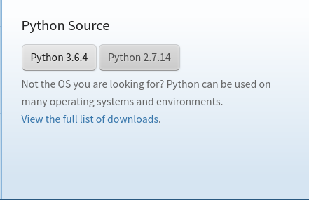
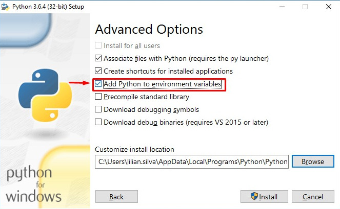

# :hammer: Escolhendo as melhores ferramentas

<p align="center">
  
</p>

## Um bom chef escolhe as melhores ferramentas

Uma analogia que sou acostumado a fazer é que programar é igual a cozinhar, você deve escolher as melhores ferramentas. Um
bom chefe gasta algumas horas escolhendo quais acessórios serão necessários para a produção do prato e já deixa na bancada de
forma que não precise ficar procurando enquanto está produzindo seu prato.

Na programação também é assim, escolhemos as ferramentas necessárias para desenvolver, testar e colocar no ar nosso sistema.

Para este curso foram escolhidas algumas ferramentas e a partir de agora iremos ver como instala-las e configura-las para que
daqui pra frente não tenhamos que parar para fazer instalação de mais uma ferramenta.

As ferrramentas foram escolhidas pensando na didática do aluno assim como compatibilidade desistemas operacionais e também por
serem as principais escolhas no mercado de trabalho.

##  Git

**O que é?**

Controle de versão livre e de código aberto, construido para lidar com projetos pequenos e grandes de maneira rápida e eficiente.

**Para que serve?**

Com certeza você já escreveu um arquivo, mais tarde troca algumas coisas e salva como final. Mais tarde ou no outro dia decide fazer mais mudanças e chama de "agoravai" e quando menos percebe já tem um monte de arquivo e talvez nem se lembre mais qual a ultima versão.

É para gerenciar alterações feitas no projeto durante o tempo que serve est ferramenta. Durante o curso vamos salvando cada progresso feito sem precisar de ter várias cópias do mesmo arquivo.

**Como instalar**

*windows:*

Para usuários windows, baixe a última versão neste [site](https://git-scm.com://git-scm.com/). Deixe as opções já marcadas por padrão, exceto a mostrada abaixo que deve ser ajustada.


*ubuntu:*

O pacote git se encontra na central de programas.

`sudo apt install git`

**Vamos verificar se deu tudo certo?**

*windows*

Clique no botão iniciar, digite `cmd` e abra o programa `prompt de comandos`. Agora digite `git --version`.

*ubuntu*

Abra um terminal e digite `git --version`.

A saída para ambos os sistemas operacionais deverá ser:

```bash
$ git --version
git version 2.16.2
```

## Python

**O que é?**

Python é uma linguagem de programação com foco em legibilidade e produtividade, criada para escrever código bom e fácil de manter de maneira rápida.

**Para que serve?**

É uma linguagem bastante versátil, e hoje em dia é amplamente utilizada para escrever sistemas web, integrações entre sistemas, automatizar tarefas e muitas outras coisas.

**Como instalar**

*windows:*

Entre em [python.org](https://www.python.org/), clique em downloads e depois selecione a versão 3.X, onde X é a versão atual mostrada no site.



Após baixar o instalador fique atento para selecionar a opção marcada na figura abaixo.



*ubuntu:*

Versões mais atuais do ubuntu já vem com o python 3 instalado, e inclusive, a partir da versão 17.10, essa passa a ser a versão padrão do sistema.

Caso python 3 não esteja instalado, utilize `sudo apt install python3`.

**Vamos verificar se deu tudo certo?**

*windows*

Clique no botão iniciar, digite `cmd` e abra o programa `prompt de comandos`. Agora digite `python3 --version`.

*ubuntu*

Abra um terminal e digite `python3 --version`.

A saída para ambos os sistemas operacionais deverá ser:

```bash
$ python3 --version
Python 3.6.4
```

## Pip

**O que é?**

**Para que serve?**

**Como instalar**

*windows:*

*ubuntu:*

**Vamos verificar se deu tudo certo?**

*windows*

*ubuntu*

## Pipenv

**O que é?**

**Para que serve?**

**Como instalar**

*windows:*

*ubuntu:*

**Vamos verificar se deu tudo certo?**

*windows*

*ubuntu*

pipenv versão 11.1.0 quando for windows

## Flask

**O que é?**

**Para que serve?**

**Como instalar**

*windows:*

*ubuntu:*

**Vamos verificar se deu tudo certo?**

*windows*

*ubuntu*

## Httpie

**O que é?**

**Para que serve?**

**Como instalar**

*windows:*

*ubuntu:*

**Vamos verificar se deu tudo certo?**

*windows*

*ubuntu*

## Pytest

**O que é?**

**Para que serve?**

**Como instalar**

*windows:*

*ubuntu:*

**Vamos verificar se deu tudo certo?**

*windows*

*ubuntu*

## Heroku CLI

**O que é?**

**Para que serve?**

**Como instalar**

*windows:*

*ubuntu:*

**Vamos verificar se deu tudo certo?**

*windows*

*ubuntu*
